- [TÍTULO DE PROYECTO](#título-de-proyecto)
  - [Antecedentes](#antecedentes)
- [REQUISITOS](#requisitos)
  - [Requisitos funcionales](#requisitos-funcionales)
- [ANÁLISIS Y DISEÑO WEB](#análisis-y-diseño-web)
  - [Prototipo web y boceto de la estructura](#prototipo-web-y-boceto-de-la-estructura)
  - [Guía de estilos](#guía-de-estilos)
  - [Planificación de tareas](#planificación-de-tareas)
  - [Base de datos](#base-de-datos)
    - [Diseño Entidad Relación de la BBDD](#diseño-entidad-relación-de-la-bbdd)
    - [Modelo relacional BBDD](#modelo-relacional-bbdd)
    - [Script de creación BBDD](#script-de-creación-bbdd)
    - [Consultas](#consultas)
  - [Validación de formularios](#validación-de-formularios)
  - [Proceso de carga](#proceso-de-carga)
  - [Jerarquía de directorios](#jerarquía-de-directorios)
    - [Contenido directorios](#contenido-directorios)
  - [Diseño de la interface](#diseño-de-la-interface)
    - [Estructura gráfica de la interface](#estructura-gráfica-de-la-interface)
- [IMPLEMENTACIÓN](#implementación)
- [PRUEBAS](#pruebas)
- [DESPLIEGUE](#despliegue)
- [HERRAMIENTAS](#herramientas)
- [LENGUAJES](#lenguajes)
- [PRODUCTO](#producto)

- [BIBLIOGRAFÍA](#bibliografía)

# TÍTULO DE PROYECTO
SK8 OR DIE
## Antecedentes
El monopatín o también llamado skate en inglés, fue una de las creaciones
más increíbles en relación al ocio, ya que desde su invención en 1963 hasta la
actualidad su uso y demanda sigue en auge. Por este motivo, en “SK8 OR DIE”
queremos aprovechar la poderosa herramienta que es internet y promocionar
nuestros productos. Se requiere crear una tienda online en la que vender
productos de skate y derivados.

# REQUISITOS

Diseñar e implementar una herramienta web eficiente donde un usuario pueda registrarse, visualizar nuestros productos y comprarlos.
## Requisitos funcionales

1-. Se permite a los clientes registrarse en la base de datos y poder iniciar
sesión para poder guardar sus datos una vez registrados. Además
restringir el acceso a ciertas opciones a usuarios no registrados o
usuarios que no tengan suficientes privilegios para ello.

2-. Se facilita un método para que los usuarios puedan cambiar sus
credenciales de acceso si lo desean.

3-. Se permite a los clientes tener un perfil para poder modificar sus datos o
poder darse de baja.
Se permite a los administradores poder administrar a los usuarios y
productos (Añadir, eliminar o modificar).Además habra una sección donde puedan ver el listado
de las categorías.

4-. Se muestre un carrusel en el cual se muestren algunos de los productos
que se venden.

5-. Se muestre uno o varios catálogo con los productos que se venden.

6-. Diseño responsive.

7-. Control de errores mediante JavaScript.

# ANÁLISIS Y DISEÑO WEB

El mapa web constará de las siguientes opciones:

- Inicio: Esta es la página principal del proyecto o al menos la que vería
primero un cliente que aún no se ha registrado. Esta página será la que
contendrá el carrusel de productos.

- Skates: Esta opción contendrá a la vez varios submenús que son las
categorías que existen, estará dividido en tres submenus, Skateboards,
Longboards y Waveboards. A la vez Skateboards tendra más submenús que son
Completos(Skateboards que son completos), Tablas(Solo la tabla del skateboard),
Ejes(Solo ejes de skateboards) y Ruedas(Solo ruedas de skateboards), con longboards
pasa lo mismo, tiene la misma estructura.

- Detalles Productos: Esta pagina se podra acceder desde la tarjeta de los productos
en el botón detalles y contendra las especificaciones de los productos.

- Accesorios: Esta será una página que solo contendrá los accesorios de
los skates.

- Sobre nosotros: Esta sección contendrá información sobre la empresa.

- Perfil: Esta sección es la que tendrá un acceso para poder editar el perfil
o en caso de los administradores incluirá un acceso para editar usuarios
y productos.

- Carrito: Este será el acceso para ver nuestro carrito de productos.

Algo gráfico más o menos seria lo siguiente:

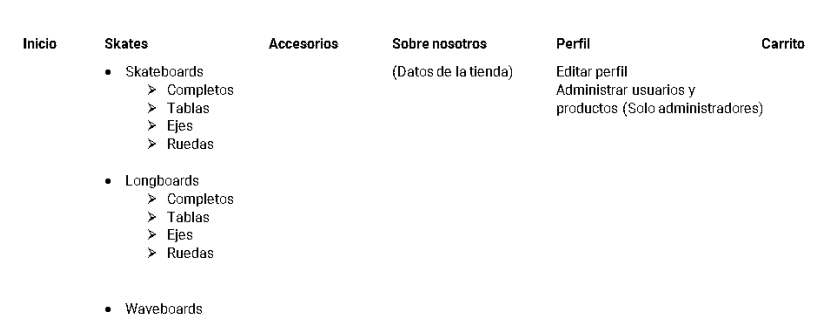

## Prototipo web y boceto de la estructura

- Inicio: Esta es más o menos la idea general de la página de inicio, a lo mejor antes de
observar esta parte, encima se inserta una imagen de bienvenida y al hacer scroll que
aparezca esta parte.

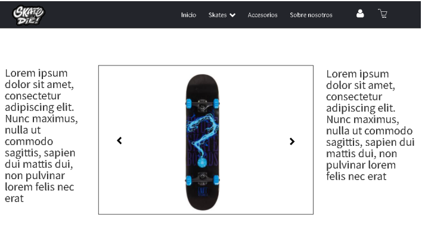

- Skates: Esta disposición es la que se usará para todos las secciones del catálogo y
accesorios. A lo mejor se añade un filtro de precio por algún lado pero esta seria la estructura.

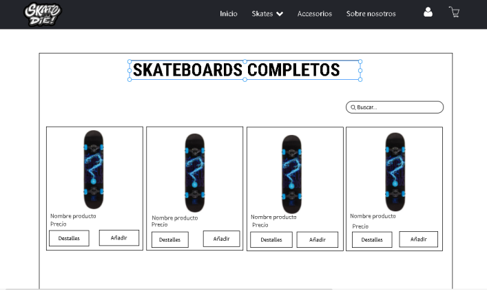

- Detalles de los productos: Esta disposición es la que se usará para todas las secciones de los detalles.

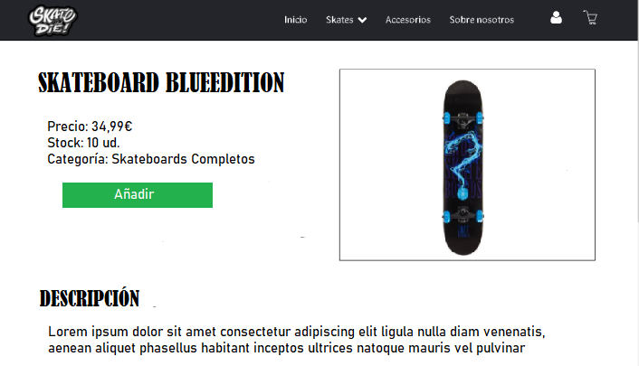

- Administración: Esta disposición se utilizará para todas las secciones de
administración, es decir, administración de usuarios y productos.

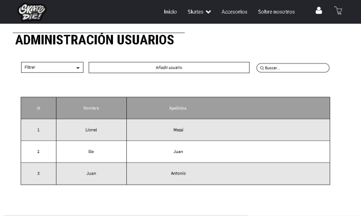

- Perfil: Esta sería más o menos la disposición del perfil.

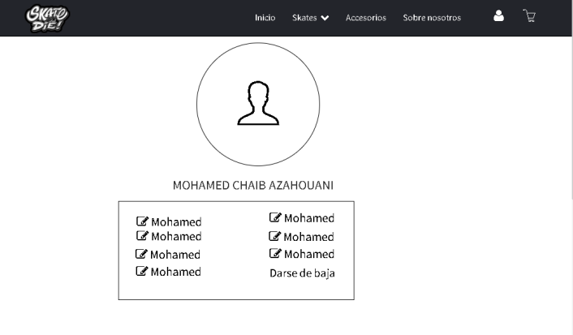

- SobreNosotros: Esta sería la disposición, algo simple y minimalista.

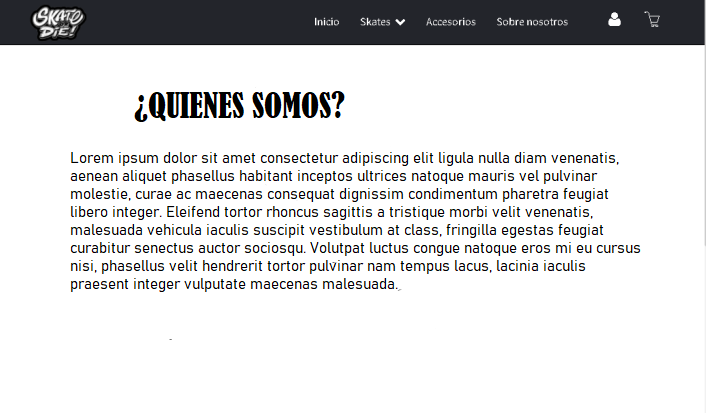

- Mapa del sitio : Esta sería la disposición del mapa del sitio.

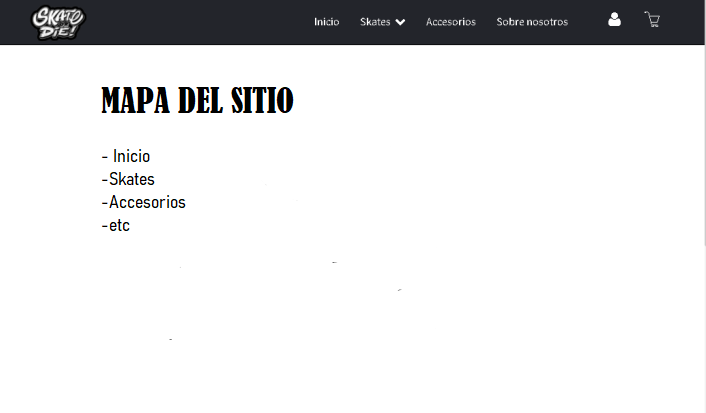

## Guía de estilos

El color principal que constituirá la página será un tono morado, exactamente es el
(#)23252B, este color será combinado con el blanco y con más tonos de este mismo
color. Estos colores se han elegido, tras una larga selección de colores, y finalmente se
llegó a la conclusión de que estos eran los que quedaban mejor y que además le dan
un toque más profesional al sitio web.

#LOGO:
 

Este finalmente será el logo de la empresa, es simplemente un logo diseñado con el
nombre de la empresa.

## Planificación de tareas

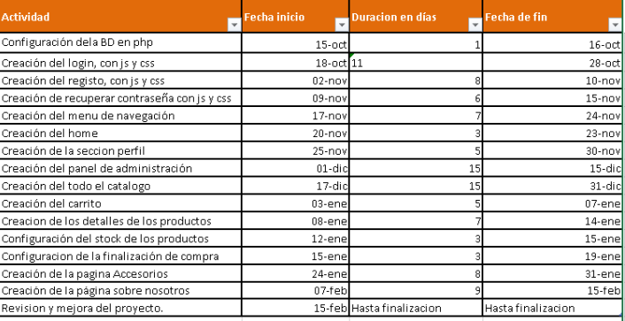

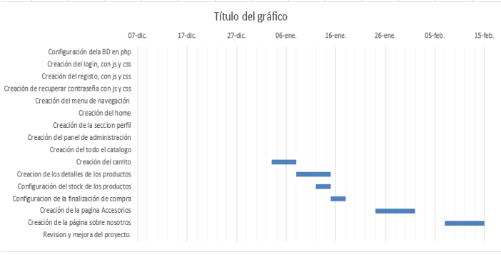

IMPORTANTE! Esto es solo una previsión no quiere decir que lo haga al pie de la letra
como en el diagrama.

## Base de datos
### Diseño Entidad Relación de la BBDD

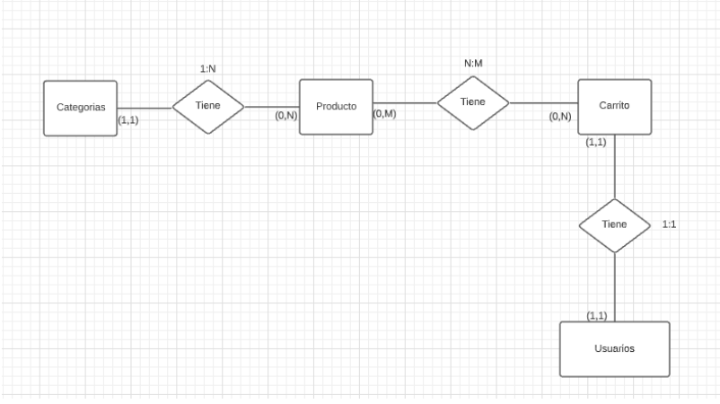
### Modelo relacional BBDD

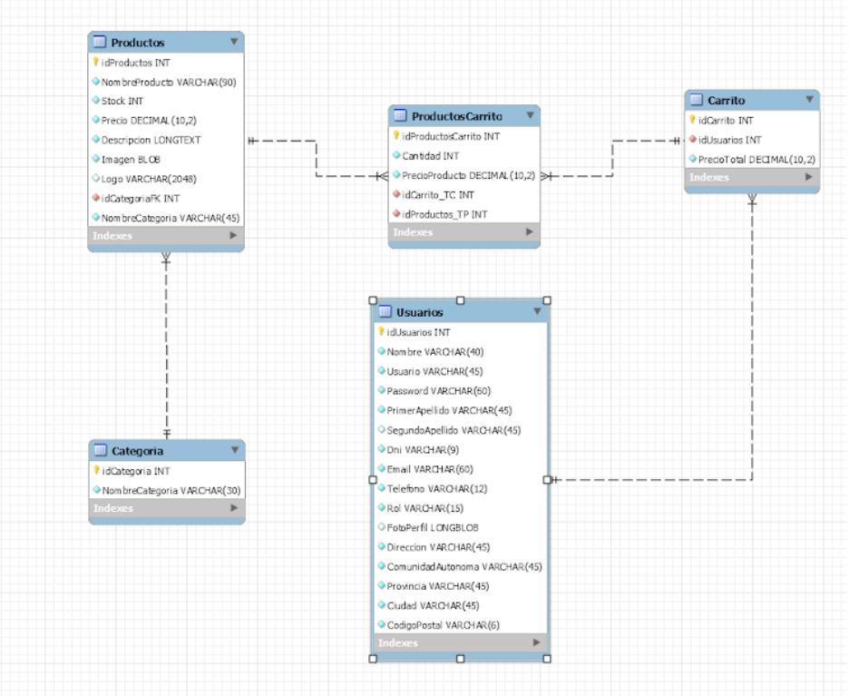
### Script de creación BBDD

Para la creación de la tabla de usuarios se ha usado el siguiente script, esta tabla es la
que almacenará todos los usuarios que se registren en la web.

----------------------------------------------------------------------------------------------
DROP TABLE IF EXISTS `usuarios`;
/*!40101 SET @saved_cs_client     = @@character_set_client */;
/*!50503 SET character_set_client = utf8mb4 */;
CREATE TABLE `usuarios` (
  `idUsuarios` int NOT NULL AUTO_INCREMENT,
  `Nombre` varchar(40) NOT NULL,
  `Usuario` varchar(45) NOT NULL,
  `Password` varchar(60) NOT NULL,
  `PrimerApellido` varchar(45) NOT NULL,
  `SegundoApellido` varchar(45) DEFAULT NULL,
  `Dni` varchar(9) NOT NULL,
  `Email` varchar(60) NOT NULL,
  `Telefono` varchar(12) NOT NULL,
  `Rol` varchar(15) NOT NULL,
  `FotoPerfil` longblob,
  `Direccion` varchar(45) DEFAULT NULL,
  `ComunidadAutonoma` varchar(45) DEFAULT NULL,
  `Provincia` varchar(45) DEFAULT NULL,
  `Ciudad` varchar(45) DEFAULT NULL,
  `CodigoPostal` varchar(6) DEFAULT NULL,
  PRIMARY KEY (`idUsuarios`),
  UNIQUE KEY `idUsuarios_UNIQUE` (`idUsuarios`),
  UNIQUE KEY `Usuario_UNIQUE` (`Usuario`),
  UNIQUE KEY `Dni_UNIQUE` (`Dni`),
  UNIQUE KEY `Email_UNIQUE` (`Email`),
) ENGINE=InnoDB AUTO_INCREMENT=36 DEFAULT CHARSET=utf8mb3;
/*!40101 SET character_set_client = @saved_cs_client */;
/*!40103 SET TIME_ZONE=@OLD_TIME_ZONE */;

/*!40101 SET SQL_MODE=@OLD_SQL_MODE */;
/*!40014 SET FOREIGN_KEY_CHECKS=@OLD_FOREIGN_KEY_CHECKS */;
/*!40014 SET UNIQUE_CHECKS=@OLD_UNIQUE_CHECKS */;
/*!40101 SET CHARACTER_SET_CLIENT=@OLD_CHARACTER_SET_CLIENT */;
/*!40101 SET CHARACTER_SET_RESULTS=@OLD_CHARACTER_SET_RESULTS */;
/*!40101 SET COLLATION_CONNECTION=@OLD_COLLATION_CONNECTION */;
/*!40111 SET SQL_NOTES=@OLD_SQL_NOTES */;


----------------------------------------------------------------------------------------------

Dato importante sobre esta tabla: los campos relacionados con la dirección no se
registraran en el registro, sino que al hacer un pedido en el momento de completar el
pago se le pedirá la dirección de envío la cual se almacenará en esta tabla, una vez
almacenados la próxima vez que se haga un pedido en el formulario aparecerá la
última dirección de envió insertada con posibilidad de cambiar la dirección si el
usuario quiere.

-----------------------------------------------------------------------------------------------
Para la creación de la tabla productos se ha utilizado el siguiente script:

DROP TABLE IF EXISTS `productos`;
/*!40101 SET @saved_cs_client     = @@character_set_client */;
/*!50503 SET character_set_client = utf8mb4 */;
CREATE TABLE `productos` (
  `idProductos` int NOT NULL AUTO_INCREMENT,
  `NombreProducto` varchar(90) NOT NULL,
  `Stock` int NOT NULL,
  `Precio` decimal(10,2) NOT NULL,
  `Descripcion` longtext NOT NULL,
  `Imagen` blob NOT NULL,
  `Logo` varchar(2048) DEFAULT NULL,
  `idCategoriaFK` int NOT NULL,
  `NombreCategoria` varchar(45) NOT NULL,
  PRIMARY KEY (`idProductos`),
  KEY `idCategoriaFK_idx` (`idCategoriaFK`),
  CONSTRAINT `idCategoriaFK` FOREIGN KEY (`idCategoriaFK`) REFERENCES `categoria` (`idCategoria`)
) ENGINE=InnoDB AUTO_INCREMENT=30 DEFAULT CHARSET=utf8mb3;
/*!40101 SET character_set_client = @saved_cs_client */;

-----------------------------------------------------------------------------------------------

En la tabla productos se almacenarán todos los productos los cuales se diferenciarán por categorías.

Para la tabla de categoria se usara el siguiente script, esta tabla solo esta creada para que
al escribir codigo directamente en un filtrado por categorías o algo por el estilo se muestren las
que hay en esta tabla.

-----------------------------------------------------------------------------------------------

DROP TABLE IF EXISTS `categoria`;
/*!40101 SET @saved_cs_client     = @@character_set_client */;
/*!50503 SET character_set_client = utf8mb4 */;
CREATE TABLE `categoria` (
  `idCategoria` int NOT NULL AUTO_INCREMENT,
  `NombreCategoria` varchar(30) NOT NULL,
  PRIMARY KEY (`idCategoria`),
  UNIQUE KEY `NombreCategoria_UNIQUE` (`NombreCategoria`)
) ENGINE=InnoDB AUTO_INCREMENT=11 DEFAULT CHARSET=utf8mb3;
/*!40101 SET character_set_client = @saved_cs_client */;

-----------------------------------------------------------------------------------------------
Para la creación de la tabla intermedia productoscarrito se ha usado el siguiente
scritp:

-----------------------------------------------------------------------------------------------

DROP TABLE IF EXISTS `productoscarrito`;
/*!40101 SET @saved_cs_client     = @@character_set_client */;
/*!50503 SET character_set_client = utf8mb4 */;
CREATE TABLE `productoscarrito` (
  `idProductosCarrito` int NOT NULL AUTO_INCREMENT,
  `Cantidad` int NOT NULL,
  `PrecioProducto` decimal(10,2) NOT NULL,
  `idCarrito_TC` int NOT NULL,
  `idProductos_TP` int NOT NULL,
  PRIMARY KEY (`idProductosCarrito`),
  UNIQUE KEY `idProductosCarrito_UNIQUE` (`idProductosCarrito`),
  KEY `idProductos_TP_idx` (`idProductos_TP`),
  KEY `idCarrito_TC_idx` (`idCarrito_TC`),
  CONSTRAINT `idCarrito_TC` FOREIGN KEY (`idCarrito_TC`) REFERENCES `carrito` (`idCarrito`),
  CONSTRAINT `idProductos_TP` FOREIGN KEY (`idProductos_TP`) REFERENCES `productos` (`idProductos`) ON DELETE CASCADE
) ENGINE=InnoDB AUTO_INCREMENT=166 DEFAULT CHARSET=utf8mb3;
/*!40101 SET character_set_client = @saved_cs_client */;

-----------------------------------------------------------------------------------------------
En esta tabla se almacenarán todos los productos añadidos por los usuarios
identificados por un idProductos_TP para identificar que producto es de la tabla
Producto y un idCarrio_TC para identificar a que carrito corresponde.

Para la tabla carrito se ha usado el siguiente script:

-----------------------------------------------------------------------------------------------

DROP TABLE IF EXISTS `carrito`;
/*!40101 SET @saved_cs_client     = @@character_set_client */;
/*!50503 SET character_set_client = utf8mb4 */;
CREATE TABLE `carrito` (
  `idCarrito` int NOT NULL,
  `idUsuarios` int NOT NULL,
  `PrecioTotal` decimal(10,2) DEFAULT NULL,
  PRIMARY KEY (`idCarrito`),
  UNIQUE KEY `idCarrito_UNIQUE` (`idCarrito`),
  UNIQUE KEY `idUsuarios_UNIQUE` (`idUsuarios`),
  CONSTRAINT `idUsuarios` FOREIGN KEY (`idUsuarios`) REFERENCES `usuarios` (`idUsuarios`) ON DELETE CASCADE ON UPDATE CASCADE
) ENGINE=InnoDB DEFAULT CHARSET=utf8mb3;
/*!40101 SET character_set_client = @saved_cs_client */;

-----------------------------------------------------------------------------------------------

Esta tabla tiene como función almacenarel  precio total del carrito de un usuario.
### Consultas 

**CONSULTAS EN RELACIÓN A USUARIOS**
```
<?php
//ESTA CONSULTA SE USA PARA COMPROBAR SI LAS CREDENCIALES SON CORRECTAS
function consultaLogin($conexion, $usuario, $password){

    $consulta = "SELECT * FROM usuarios where Usuario = '$usuario' AND Password = '$password'";

    $resultado = mysqli_query($conexion, $consulta);
    return $resultado;
}

// ESTA CONSULTA SE USA PARA CREAR Y GUARDAR LA SESION DE UN USUARIO
function crearSesion($usuario){
    //Asignamos el id
    session_id($usuario['Usuario']);
    //Iniciamos la sesion
    session_start();
    $_SESSION['usuarioConectado']=true;

    //Guardamos los datos en la sesion
    foreach($usuario as $indice=>$valor){
        $_SESSION[$indice] = $valor;
    }
}

//ESTA CONSULTA SE USA PARA COMPROBAR QUE EL NOMBRE DE USUARIO ES CORRECTO
function validarUsuario($conexion, $usuario){

    $consulta = "SELECT * FROM usuarios where Usuario = '$usuario'";

    $resultado = mysqli_query($conexion, $consulta);
    return $resultado;
}
//ESTA CONSULTA SE UTILIZA PARA COMPROBAR QUE UN USARIO EXISTE
function buscarUsuarioID($conexion, $idUsuario){

    $consulta = "SELECT * FROM usuarios where idUsuarios = '$idUsuario'";

    $resultado = mysqli_query($conexion, $consulta);
    return $resultado;
}

//ESTA CONSULTA SE UTILIZA PARA QUE EL USUARIO SE DE DE BAJA
function darseDeBaja($conexion, $idUsuario){

    $consulta = "DELETE FROM usuarios where idUsuarios = '$idUsuario'";

    $resultado = mysqli_query($conexion, $consulta);
    return $resultado;
}


// Para validar individualmente Email y dni para determinar que el error es porque alguno de esos campos ya existen 
//******************************* */

//CONSULTA PARA VALIDAR EL DNI
function comprobarDni($conexion, $dni){

    $consulta = "SELECT * FROM usuarios where Dni = '$dni'";

    $resultado = mysqli_query($conexion, $consulta);
    return $resultado;
}
//CONSULTA PARA VALIDAR EL EMAIL
function comprobarEmail($conexion, $email){

    $consulta = "SELECT * FROM usuarios where Email = '$email'";

    $resultado = mysqli_query($conexion, $consulta);
    return $resultado;
}
//CON ESTA FUNCION SE COMPRUEBA QUE LA DIRECCION EXISTE
function comprobarDireccion($conexion, $direccion){

    $consulta = "SELECT * FROM usuarios where Direccion = '$direccion'";

    $resultado = mysqli_query($conexion, $consulta);
    return $resultado;
}

//******************************* */

//CONSULTA PARA VALIDAR EL EMAIL(SIMILAR PERO NO IGUAL A LAS ANTERIORES)
function validarEmail($conexion, $email, $usuario){

    $consulta = "SELECT * FROM usuarios where Email = '$email' AND Usuario = '$usuario'";

    $resultado = mysqli_query($conexion, $consulta);
    return $resultado;
}

//CONSULTA PARA VALIDAR EL DNI(SIMILAR PERO NO IGUAL A LAS ANTERIORES)
function validarDni($conexion, $dni, $usuario){

    $consulta = "SELECT * FROM usuarios where Dni = '$dni' AND Usuario = '$usuario'";

    $resultado = mysqli_query($conexion, $consulta);
    return $resultado;
}

//ESTA CONSULTA SE USA PARA REGISTRA A UN USUARIO
function registro($conexion, $nombre, $usuario, $password, $primerapellido, $segundoapellido, $dni, $email, $telefono, $fotoperfil){

    $consulta = "INSERT INTO `usuarios` (`Nombre`, `Usuario`, `Password`, `PrimerApellido`, `SegundoApellido`, `Dni`, `Email`, `Telefono`, `Rol`, `FotoPerfil`, `Direccion`,`ComunidadAutonoma`,`Provincia`, `Ciudad`, `CodigoPostal`) VALUES ('$nombre', '$usuario', '$password', '$primerapellido', '$segundoapellido', '$dni', '$email', '$telefono', 'Usuario', '$fotoperfil','','','','','')";
    $resultado = mysqli_query($conexion, $consulta);
    return $resultado;
}

//ESTA CONSULTA SE USA PARA REGISTRA A UN USUARIO EN CASO DE QUE NO QUIERA AGREGAR UNA FOTO DE PERFIL
function registroSinFoto($conexion, $nombre, $usuario, $password, $primerapellido, $segundoapellido, $dni, $email, $telefono){

    $consulta = "INSERT INTO usuarios (`Nombre`, `Usuario`, `Password`, `PrimerApellido`, `SegundoApellido`, `Dni`, `Email`, `Telefono`, `Rol`, `Direccion`,`ComunidadAutonoma`,`Provincia`, `Ciudad`, `CodigoPostal` ) VALUES ('$nombre', '$usuario', '$password', '$primerapellido', '$segundoapellido', '$dni', '$email', '$telefono', 'Usuario','','','','','')";
    $resultado = mysqli_query($conexion, $consulta);
    return $resultado;
}

//CON ESTA CONSULTA SE CREA UN CARRITO AL REGISTRAR A UN USUARIO
function crearCarrito($conexion, $idCarrito, $idUsuarios){
    $consulta ="INSERT INTO `carrito` (`idCarrito`, `idUsuarios`) VALUES ('$idCarrito', '$idUsuarios')";
    $resultado = mysqli_query($conexion, $consulta);
    return $resultado;
}

//CON ESTA CONSULTA SE ACTUALIZA LA CONTRASEÑA DE UN USUARIO
function updatePassword($conexion,$idUsuario, $password){
    $consulta = "UPDATE usuarios SET Password = '$password' WHERE (idUsuarios = '$idUsuario');";
    $resultado = mysqli_query($conexion,$consulta);
    return $resultado;
}

//CON ESTA CONSULTA SE EDITA EL NOMBRE DE USUARIO
function editarUsuario($conexion,$idUsuario, $usuario){
    $consulta = "UPDATE usuarios SET Usuario = '$usuario' WHERE (`idUsuarios` = '$idUsuario');";
    $resultado = mysqli_query($conexion,$consulta);
    return $resultado;
}

//CON ESTA CONSULTA SE EDITA EL NOMBRE 

function editarNombre($conexion,$idUsuario, $nombre){
    $consulta = "UPDATE usuarios SET Nombre = '$nombre' WHERE (`idUsuarios` = '$idUsuario');";
    $resultado = mysqli_query($conexion,$consulta);
    return $resultado;
}

//CON ESTA CONSULTA SE EDITA EL PRIMER APELLIDO
function editarPrimerApellido($conexion,$idUsuario, $primerApellido){
    $consulta = "UPDATE usuarios SET PrimerApellido = '$primerApellido' WHERE (`idUsuarios` = '$idUsuario');";
    $resultado = mysqli_query($conexion,$consulta);
    return $resultado;
}
//CON ESTA CONSULTA SE EDITA EL EL SEGUNDO APELLIDO
function editarSegundoApellido($conexion,$idUsuario, $segundoApellido){
    $consulta = "UPDATE usuarios SET SegundoApellido = '$segundoApellido' WHERE (`idUsuarios` = '$idUsuario');";
    $resultado = mysqli_query($conexion,$consulta);
    return $resultado;
}
//CON ESTA CONSULTA SE EDITA EL DIRECCION
function editarDireccion($conexion,$idUsuario, $direccion){
    $consulta = "UPDATE usuarios SET Direccion = '$direccion' WHERE (`idUsuarios` = '$idUsuario');";
    $resultado = mysqli_query($conexion,$consulta);
    return $resultado;
}

//CON ESTA CONSULTA SE EDITA LA COMUNIDAD AUTONOMA
function editarCa($conexion,$idUsuario, $ca){
    $consulta = "UPDATE usuarios SET ComunidadAutonoma = '$ca' WHERE (`idUsuarios` = '$idUsuario');";
    $resultado = mysqli_query($conexion,$consulta);
    return $resultado;
}

//CON ESTA CONSULTA SE EDITA LA PROVINCIA
function editarProvincia($conexion,$idUsuario, $provincia){
    $consulta = "UPDATE usuarios SET Provincia = '$provincia' WHERE (`idUsuarios` = '$idUsuario');";
    $resultado = mysqli_query($conexion,$consulta);
    return $resultado;
}
function editarCiudad($conexion,$idUsuario, $ciudad){
    $consulta = "UPDATE usuarios SET Ciudad = '$ciudad' WHERE (`idUsuarios` = '$idUsuario');";
    $resultado = mysqli_query($conexion,$consulta);
    return $resultado;
}
//CON ESTA CONSULTA SE EDITA EL CODIGO POSTAL
function editarCodPost($conexion,$idUsuario, $codPost){
    $consulta = "UPDATE usuarios SET CodigoPostal = '$codPost' WHERE (`idUsuarios` = '$idUsuario');";
    $resultado = mysqli_query($conexion,$consulta);
    return $resultado;
}
//CON ESTA CONSULTA SE EDITA EL TELEFONO
function editarTelefono($conexion,$idUsuario, $telefono){
    $consulta = "UPDATE usuarios SET Telefono = '$telefono' WHERE (`idUsuarios` = '$idUsuario');";
    $resultado = mysqli_query($conexion,$consulta);
    return $resultado;
}

//CON ESTA CONSULTA SE EDITA EL EMAIL
function editarEmail($conexion,$idUsuario, $email){
    $consulta = "UPDATE usuarios SET Email = '$email' WHERE (`idUsuarios` = '$idUsuario');";
    $resultado = mysqli_query($conexion,$consulta);
    return $resultado;
}
//CON ESTA CONSULTA SE EDITA EL DNI
function editarDni($conexion,$idUsuario, $dni){
    $consulta = "UPDATE usuarios SET Dni = '$dni' WHERE (`idUsuarios` = '$idUsuario');";
    $resultado = mysqli_query($conexion,$consulta);
    return $resultado;
}
//CON ESTA CONSULTA SE EDITA EL ROL
function editarRol($conexion,$idUsuario, $rol){
    $consulta = "UPDATE usuarios SET Rol = '$rol' WHERE (`idUsuarios` = '$idUsuario');";
    $resultado = mysqli_query($conexion,$consulta);
    return $resultado;
}
//CON ESTA CONSULTA SE EDITA LA FOTO DE PERFIL
function actualizarFotoPerfil($conexion, $fotoPerfil, $idUsuario){
    $consulta = "UPDATE usuarios SET FotoPerfil = '$fotoPerfil' WHERE (`idUsuarios` = '$idUsuario');";
    $resultado = mysqli_query($conexion,$consulta);
    return $resultado;
}

//CON ESTA CONSULTA SE LISTAN LOS USUARIOS

function listarUsuarios($conexion){

    $consulta = "SELECT * FROM usuarios";
    $resultado = mysqli_query($conexion, $consulta);
    return $resultado;
}
//CON ESTA CONSULTA SE ELIMINA UN USUARIO EN LA ADMINISTRACION
function eliminarUsuario($conexion, $idUsuario){

    $consulta = "DELETE FROM usuarios WHERE idUsuarios = '$idUsuario'";
    $resultado = mysqli_query($conexion, $consulta);
    return $resultado;
}

//CON ESTA CONSULTA SE USA PARA EL SEARCH DE LOS ADMIN
function buscarUsuarios($conexion,$variableBusqueda){

    $consulta = "SELECT * FROM usuarios where idUsuarios like '%$variableBusqueda%' 
        or Usuario like '%$variableBusqueda%'
        or Nombre like '%$variableBusqueda%'
        or PrimerApellido like '%$variableBusqueda%'
        or SegundoApellido like '%$variableBusqueda%'
        or Telefono like '%$variableBusqueda%'
        or Email like '%$variableBusqueda%'
        or DNI like '%$variableBusqueda%'
        or Direccion like '%$variableBusqueda%'
        or ComunidadAutonoma like '%$variableBusqueda%'
        or Provincia like '%$variableBusqueda%'
        or Ciudad like '%$variableBusqueda%'
        or CodigoPostal like '%$variableBusqueda%'
        or ROL like '%$variableBusqueda%';";

    $resultado = mysqli_query($conexion, $consulta);
    return $resultado;
}
//CON ESTA CONSULTA SE USA PARA EL FILTRO DE LOS ADMIN
function filtrarUsuario($conexion, $categoria){

    $consulta = "SELECT * FROM usuarios WHERE Rol='$categoria'";
    $resultado = mysqli_query($conexion, $consulta);
    return $resultado;
}
//CON ESTA FUNCIÓN SE COMPRUEBA EL PRECIO TOTAL
function comprobarPrecioTotalCarrito($conexion){

    $consulta = "SELECT * FROM carrito";
    $resultado = mysqli_query($conexion, $consulta);
    return $resultado;
}
//CON ESTA CONSULTA SE REGISTRA LA DIRECCION DE ENVIO
function registrarDireccionDeEnvio($conexion, $idUsuario, $direccion, $comAuto, $provincia, $ciudad, $codPost){

    $consulta = "UPDATE usuarios SET `Direccion` = '$direccion', `ComunidadAutonoma` = '$comAuto', `Provincia` = '$provincia', `Ciudad` = '$ciudad', `CodigoPostal` = '$codPost' WHERE (`idUsuarios` = '$idUsuario');";
    $resultado = mysqli_query($conexion, $consulta);
    return $resultado;
}

?>
```
**CONSULTAS EN RELACIÓN A PRODUCTOS**
```
<?php
//CONSULTA PARA LISTAR LOS PRODUCTOS
function listarProductos($conexion){

    $consulta = "SELECT * FROM productos";
    $resultado = mysqli_query($conexion, $consulta);
    return $resultado;
}
//CONSULTA PARA LOS PRODUCTOS SEGÚN SE ESPECIFIQUE UNA CATEGORÍA
function listarProductosSegunCategoria($conexion, $categoria){

    $consulta = "SELECT * FROM tiendaskate.productos where idCategoriaFK='$categoria';";
    $resultado = mysqli_query($conexion, $consulta);
    return $resultado;
}
//CONSULTA PARA MOSTRAR UN PRODUCTO
function listarProductoId($conexion, $idProducto){

    $consulta = "SELECT * FROM productos where idProductos ='$idProducto'";
    $resultado = mysqli_query($conexion, $consulta);
    return $resultado;
}
//CONSULTA PARA VALIDAR EL NOMBRE DE UN PRODUCTO
function comprobarNombreProducto($conexion, $nombreProducto){

    $consulta = "SELECT * FROM productos where NombreProducto ='$nombreProducto'";
    $resultado = mysqli_query($conexion, $consulta);
    return $resultado;
}
//CONSULTA PARA LA BUSQUEDA DE PRODUCTOS
function buscarProductos($conexion,$variableBusqueda, $categoria){

    $consulta = "SELECT * FROM tiendaskate.productos where idCategoriaFK='$categoria' and NombreProducto like '%$variableBusqueda%'";
    $resultado = mysqli_query($conexion, $consulta);
    return $resultado;
}
//CONSULTA PARA EL FILTRADO DE PRODUCTOS SEGUN LA CATEGORIA
function filtrarPrecioProductos($conexion, $valor1,$valor2,$categoria){

    $consulta = "SELECT * FROM tiendaskate.productos where idCategoriaFK='$categoria' and Precio BETWEEN '$valor1' and '$valor2';";
    $resultado = mysqli_query($conexion, $consulta);
    return $resultado;
}

//CONSULTA PARA LA BUSQUEDA DE PRODUCTOS EN EL PANEL ADMIN
function buscarProductosAdmin($conexion,$variableBusqueda){

    $consulta = "SELECT * FROM productos where idProductos like '%$variableBusqueda%' 
    or NombreProducto like '%$variableBusqueda%'
    or Precio like '%$variableBusqueda%'
    or Descripcion like '%$variableBusqueda%'
    or NombreCategoria like '%$variableBusqueda%'";

    $resultado = mysqli_query($conexion, $consulta);
    return $resultado;
}
//CONSULTA PARA EL FILTRO DE PRODUCTOS EN EL PANEL ADMIN
function filtrarProductos($conexion, $categoria){

    $consulta = "SELECT * FROM productos WHERE idCategoriaFK='$categoria'";
    $resultado = mysqli_query($conexion, $consulta);
    return $resultado;
}
//CONSULTA PARA ELIMINACION DE PRODUCTOS EN EL PANEL ADMIN
function eliminarProducto($conexion, $idProducto){

    $consulta = "DELETE FROM productos WHERE idProductos = '$idProducto'";
    $resultado = mysqli_query($conexion, $consulta);
    return $resultado;
}
//CONSULTA PARA AÑADIR  PRODUCTOS EN EL PANEL ADMIN
function addProducto($conexion,$nombreProducto,$precioProducto,$descripcionProducto,$stockProducto,$categoriaProducto,$idCategoria,$imagenProducto){

    $consulta = "INSERT INTO productos (`NombreProducto`, `Stock`, `Precio`,`Descripcion`, `Imagen`,`idCategoriaFK`, `NombreCategoria`) VALUES ('$nombreProducto', '$stockProducto', '$precioProducto','$descripcionProducto', '$imagenProducto','$idCategoria', '$categoriaProducto');";
    $resultado = mysqli_query($conexion, $consulta);
    return $resultado;
}
//CONSULTA PARA EDICION DE PRODUCTOS SIN TOCAR LA IMAGEN EN EL PANEL ADMIN
function editarProductoSinImagen($conexion,$nombreProducto,$precioProducto,$descripcionProducto,$stockProducto,$categoriaProducto,$idCategoria,$idProducto){

    $consulta = "UPDATE `tiendaskate`.`productos` SET `NombreProducto` = '$nombreProducto', `Stock` = '$stockProducto', `Precio` = '$precioProducto', `Descripcion` = '$descripcionProducto', `idCategoriaFK` = '$idCategoria', `NombreCategoria` = '$categoriaProducto' WHERE (`idProductos` = '$idProducto');";
    $resultado = mysqli_query($conexion, $consulta);
    return $resultado;
}
//CONSULTA PARA EDICION DE PRODUCTOS EDITANDO LA IMAGEN EN EL PANEL ADMIN
function editarProductoConImagen($conexion,$nombreProducto,$precioProducto,$descripcionProducto,$stockProducto,$categoriaProducto,$idCategoria, $imagenProducto,$idProducto){

    $consulta = "UPDATE `tiendaskate`.`productos` SET `NombreProducto` = '$nombreProducto', `Stock` = '$stockProducto', `Precio` = '$precioProducto', `Descripcion` = '$descripcionProducto', `idCategoriaFK` = '$idCategoria', `NombreCategoria` = '$categoriaProducto', `Imagen`='$imagenProducto' WHERE (`idProductos` = '$idProducto');";
    $resultado = mysqli_query($conexion, $consulta);
    return $resultado;
}
//CONSULTA PARA COMPROBAR LOS PRODUCTOS DE UN USUARIO EN SU CARRITO
function buscarProductosCarrito($conexion, $idProducto,$idCarrito){

    $consulta = "SELECT * FROM tiendaskate.productoscarrito where idProductos_TP='$idProducto' and idCarrito_TC='$idCarrito'";
    $resultado = mysqli_query($conexion, $consulta);
    return $resultado;
}
//CONSULTA PARA ACTUALIZAR LA CANTIDAD DE UN PRODUCTO EN EL CARRITO SI ESE PRODUCTO YA EXISTE
function actualizarCantidadProductosEnElCarrito($conexion, $idItem, $cantidadP){
    $consulta = "UPDATE productoscarrito SET Cantidad = '$cantidadP'+1 WHERE (idProductosCarrito = '$idItem');";
    //EJECUTAMOS LA CONSULTA
    $resultado = mysqli_query($conexion,$consulta);
    return $resultado;
}
//CONSULTA PARA AÑADIR UN PRODUCTO AL CARRITO
function addProductosAlCarrito($conexion,$cantidad, $precio, $idCarrito, $idProducto){
    $consulta = "INSERT INTO `tiendaskate`.`productoscarrito` (`Cantidad`, `PrecioProducto`, `idCarrito_TC`, `idProductos_TP`) VALUES ('$cantidad', '$precio', '$idCarrito', '$idProducto');";
    $resultado= mysqli_query($conexion,$consulta);
    return $resultado;
}
//CONSULTA PARA SUMAR EL PRECIO TOTAL DE LOS PRODUCTOS
function sumarPrecioTotalCarrito($conexion,$idCarrito){

    $consulta = "SELECT SUM(PrecioProducto*Cantidad)FROM tiendaskate.productoscarrito where idCarrito_TC='$idCarrito' ";
    $resultado = mysqli_query($conexion, $consulta);
    return $resultado;
}
//CONSULTA PARA AÑADIR EL PRECIO TOTAL A LA TABLA CARRITO
function insertarPrecioTotalCarrito($conexion,$idCarrito,$idUsuario, $precioTotal){

    $consulta = "UPDATE `tiendaskate`.`carrito` SET `PrecioTotal` = '$precioTotal' WHERE `idCarrito` = '$idCarrito' and idUsuarios='$idUsuario'";
    $resultado = mysqli_query($conexion, $consulta);
    return $resultado;
}
//CONSULTA PARA ACTUALIZAR EL PRECIO TOTAL DEL CARRITO A 0 DESPUES DEL PAGO
function insertarPrecioTotalCarritoPagoFinal($conexion,$idCarrito){

    $consulta = "UPDATE `tiendaskate`.`carrito` SET `PrecioTotal` = '0.00' WHERE `idCarrito` = '$idCarrito'";
    $resultado = mysqli_query($conexion, $consulta);
    return $resultado;
}
//CONSULTA PARA SUMAR LA CANTIDAD DE PRODUCTOS QUE HAY EN EL CARRITO
function sumarCantidadProductosCarrito($conexion,$idCarrito){

    $consulta = "SELECT SUM(Cantidad)FROM tiendaskate.productoscarrito where idCarrito_TC='$idCarrito' ";
    $resultado = mysqli_query($conexion, $consulta);
    return $resultado;
}
//CONSULTA PARA MOSTRAR LOS PRODUCTOS QUE HAY EN EL CARRITO
function mostrarProductosCarrito($conexion,$idCarrito){

    $consulta = "SELECT * FROM productoscarrito where idCarrito_TC='$idCarrito'";
    $resultado = mysqli_query($conexion, $consulta);
    return $resultado;
}
//CONSULTA PARA MOSTRAR EL NOMBRE DE LOS PRODUCTOS QUE HAY EN EL CARRITO
function mostrarNombreProductosCarrito($conexion,$idProducto){

    $consulta = "SELECT * FROM productos where idProductos='$idProducto'";
    $resultado = mysqli_query($conexion, $consulta);
    return $resultado;
}
//CONSULTA PARA ELIMINAR UN PRODUCTO QUE HAY EN EL CARRITO
function eliminarProductoCarrito($conexion,$idProducto){

    $consulta = "DELETE FROM productoscarrito where idProductosCarrito='$idProducto'";
    $resultado = mysqli_query($conexion, $consulta);
    return $resultado;
}
//CONSULTA PARA DISMINUIR LA CANTIDAD DE UN PRODUCTO EN EL CARRITO
function eliminarUnProductoCarrito($conexion, $idProducto,$cantidad){

    $consulta = "update tiendaskate.productoscarrito set `Cantidad`='$cantidad' where idProductosCarrito='$idProducto'";
    $resultado = mysqli_query($conexion, $consulta);
    return $resultado;
}
//CONSULTA PARA AUMENTAR LA CANTIDAD DE UN PRODUCTO EN EL CARRITO
function addUnProductoCarrito($conexion, $idProducto,$cantidad){

    $consulta = "update tiendaskate.productoscarrito set `Cantidad`='$cantidad' where idProductosCarrito='$idProducto'";
    $resultado = mysqli_query($conexion, $consulta);
    return $resultado;
}
//CONSULTA PARA VACIAR EL CARRITO

function vaciarCarrito($conexion, $idCarrito){

    $consulta = "DELETE FROM `tiendaskate`.`productoscarrito` WHERE (`idCarrito_TC` = '$idCarrito');";
    $resultado = mysqli_query($conexion, $consulta);
    return $resultado;
}

//CONSULTA PARA MOSTRAR EL PRECIO TOTAL DEL CARRITO CARRITO
function mostrarPrecioTotalCarrito($conexion, $idCarrito){

    $consulta = "SELECT * FROM tiendaskate.carrito where idCarrito='$idCarrito';";
    $resultado = mysqli_query($conexion, $consulta);
    return $resultado;
}
//CONSULTA PARA MOSTRAR PRODUCTOS RANDOM EN LOS CARRUSELES DE SKATES,LONG Y WAVEBOARDS
function buscarProductosRandom($conexion){
    $consulta = "SELECT DISTINCT * FROM productos 
    where idCategoriaFK='1' 
    or idCategoriaFK='2'  
    or idCategoriaFK='5'
    or idCategoriaFK='6'
    or idCategoriaFK='9'
    order by rand() Limit 6;";
    $resultado= mysqli_query($conexion,$consulta);
    return $resultado;
}
//CONSULTA PARA MOSTRAR PRODUCTOS RANDOM EN LOS CARRUSELES DE EJES
function buscarProductosRandomEjes($conexion){
    $consulta = "SELECT DISTINCT * FROM productos 
    where idCategoriaFK='3' 
    or idCategoriaFK='7'  
    order by rand() Limit 6;";
    $resultado= mysqli_query($conexion,$consulta);
    return $resultado;
}
//CONSULTA PARA MOSTRAR PRODUCTOS RANDOM EN LOS CARRUSELES DE RUEDAS
function buscarProductosRandomRuedas($conexion){
    $consulta = "SELECT DISTINCT * FROM productos 
    where idCategoriaFK='4' 
    or idCategoriaFK='8'  
    order by rand() Limit 6;";
    $resultado= mysqli_query($conexion,$consulta);
    return $resultado;
}
//CONSULTA PARA OBTENER EL PRECIO TOTAL DE UN CARRITO 
function obtenerPrecioTotalCarrito($conexion, $idUsuario){

    $consulta = "SELECT * FROM carrito where idUsuarios='$idUsuario'";
    $resultado = mysqli_query($conexion, $consulta);
    return $resultado;
}
//CONSULTA PARA RESTAR EL STOCK DE UN PRODCTO DESPUES DE COMPRARLO
function restarStockProducto($conexion, $idProducto, $cantidad){

    $consulta = "UPDATE `tiendaskate`.`productos` SET `Stock` = Stock-'$cantidad' WHERE (`idProductos` = '$idProducto');";
    $resultado = mysqli_query($conexion, $consulta);
    return $resultado;
}
//CONSULTA PARA COMPARAR LOS DATOS DE UN PRODUCTO EN LA TABLA productos CON EL QUE TENEMOS EN EL CARRITO POR SI SU STOCK HA CAMBIADO
function pagoFinalListaProductosCarrito($conexion){

    $consulta = "SELECT * from productos inner join productoscarrito where productos.idProductos = productoscarrito.idProductos_TP;";
    $resultado = mysqli_query($conexion, $consulta);
    return $resultado;
}
//CONSULTA PARA ELIMINAR UN CARRITO
function eliminarCarrito($conexion, $idCarrito){

    $consulta = "DELETE FROM carrito where idCarrito='$idCarrito'";
    $resultado = mysqli_query($conexion, $consulta);
    return $resultado;
}


?>
```
**CONSULTAS EN RELACIÓN A CATEGORÍAS**
```
<?php
//CONSULTA PARA LISTAR LAS CATEGORIAS
function listarCategorias($conexion){

    $consulta = "SELECT * FROM categoria";
    $resultado = mysqli_query($conexion, $consulta);
    return $resultado;
}
//CONSULTA PARA EL SEARCH DE LAS CATEGORIAS
function buscarCategoriasAdmin($conexion,$variableBusqueda){

    $consulta = "SELECT * FROM categoria where idCategoria like '%$variableBusqueda%' 
    or NombreCategoria like '%$variableBusqueda%'";

    $resultado = mysqli_query($conexion, $consulta);
    return $resultado;
}
//CONSULTA PARA EL FILTRO DE LAS CATEGORIAS
function filtrarCategoria($conexion, $categoria){

    $consulta = "SELECT * FROM categoria WHERE idCategoria='$categoria'";
    $resultado = mysqli_query($conexion, $consulta);
    return $resultado;
}


?>
```

## Validación de formularios
Formulario de login, registro, dirección de envío, recuperación de contraseña, añadir usuario,
añadir producto, editar producto.El tipo de validación será por JS, obteniendo los campos y
controlandolos por funciones y eventos.
Hay mas formularios que se muestran con ventanas emergentes, como por ejemplo al editar el perfil 
tanto cuando lo hace un admin como un usuario con sweetalert que se controlan mediante php.


## Proceso de carga
En primer lugar, tendríamos nuestra página principal que sería "home.php", en esta página si no hemos 
iniciado sesión tendriamos varios enlaces, empecemos con los que se encuentran al desplegar el icono del
muñeco en el menú, tendriamos:

- Inicio: Te dirige a "login.php", en el login tenemos un formulario en el cual si se envian los datos se comprueban
en el archivo "comprobarLogin.php" y si son correctos te redirige al "home.php" con los datos de tu sesión. Por otro
lado tendríamos el enlace que hay debajo del formulario de inicio de sesion que es recuperar contraseña, este te lleva a "recuperarContraseña.php", este es un formularío el cual comprueba tus datos con el archivo "comprobarDatosRecCon.php", si
son correctos se envían un correo a tu email con un enlace que te redirige a "nuevaPassword.php" para que actualice la contraseña
el proceso de actualización en la bbdd se realiza en el archivo "updatePassword.php". Volviendo al login, tendriamos otro enlace que
simplemente te lleva al registo.

- Registro: La página a la que te lleva sería "registro.php", es un formulario que si introduces bien los datos los comprueba y registra
en "comprobarRegistro.php", posteriormente se te redirige de nuevo al login para que inicies la sesión.

Una vez hemos iniciado sesión, volveremos al muñeco y veremos que dependiendo de si es Usuario o Admin, tendra Perfil/Logout o
Perfil/Administracion/Logout.

Si vamos al perfil: Nos llevara a la pagina "PerfilUsuario.php", donde podremos observar y modificar nuestros datos. Si quisieramos,
modificar nuestros datos al hacer click en el botón de edición no saldría una ventana emergente de sweetalert, el cual es un formulario
que se validad por php y sen envia por ajax, se envia al archivo "Perfil.js" en el cual se hace el envio al archivo php del campo que
se haya elegido, la sintaxis del archivo seria "EditarNombreDelCampo.php". En caso de actualizar la imagen, se usado un modal de bootstrap, el cual se ha almacenado en "ModalFotoPerfilUsuario.php" que es un formulario que tiene un accion hacia "EditarFotoPerfil.php", el cual te redirecciona con un header a "PerfilUsuario.php". Tambien se encuentra el darse de baja que es otro modal de bootstrap que se encuentra en el archivo "ModalDeleteMe.php" que es un formulario con un accion a "DarseDeBaja.php" que te redirecciona al home.

Si accedemos al enlace de Administración: La pagina nos llevara a "Adminitracion.php", en la cual habra tres botones:

- Usuarios: Nos dirigira a "AdministracionUsuarios.php", en esta parte tendremos un boton de añadir usuario que si pulsamos nos saldrá un modal que se encuentra en "ModalAñadirUsuarioAdmin.php" el cual es un formulario que envia los datos por ajax hacia "AñadirUsuarioAdmin.php". Más abajo en la pagina de "AdministracionUsuarios.php", tendremos una tabla que nos permitirá editar los datos de un usuarios, esto funcionará igual que en el Perfil,esta te envia a "EditarUsuarioAdmin.php", solo que ahora te enviara a archivos más o menos con el mismo nombre pero con la terminación Admin. Aparte de editar tenemos un boton de eliminar, el cual al pulsarlo te sale una ventana de confirmacion en la cual si damos que sí enviara los daros por Ajax a "EliminarUsuario.php".

- Productos: Nos dirigira a "AdministracionProductos.php", en esta parte tendremos un boton de añadir producto que si pulsamos nos saldrá un modal que se encuentra en "ModalAñadirProductoAdmin.php", este es un formulario con un accion hacia "AddProductoAdmin.php",
que posteriormente nos redirigira de nuevo a "AdministracionProductos.php". Más abajo en la pagina de "AdministracionProductos.php", 
encotraremos una tabla con el boton editar que si le damos nos dirigira "EditarProductoAdmin.php", en este formulario si editamos algo 
y le damos al boton de guradar nos enviará a la página de "ConfirmarEdicionProductoAdmin.php" en la cual actualizará los datos y hara una redireccion a la pagina de "EditarProductoAdmin.php", en esta misma pagina tenemos un boton para volver a "AdministracionProductos.php", si volvemos, en la tabla tambien veremos el boton de eliminar el cual al pulsarlo te sale una ventana de confirmacion en la cual si damos que sí enviara los daros por Ajax a "EliminarProductoAdmin.php".

- Categorías: Esta te envía a "AdministrarCategorias.php", y en esta página solo se muestran las categorías.

Ahora si volvemos al menu y accedemos a algún submenu de skates o al enlace que se encuentra al lado que es accesorios nos llevara a los catalogos de la página, por ejemplo si accedemos a Skateboards Completos, nos redirigira a "CatalogoSkateBoardsCompleto.php", y asi con los demas. En estos catálogos se encuentran las cartas de los productos y tenemos dos botones en ellas:

- Añadir: este boton realiza con ajax el envio de datos del producto a la página "AddCarrito.php" y se nos añade el producto a nuestro carrito.

- Detalles: este boton te envia a "DetallesProductoSkateBoardsCompletos.php", en esta página tendremos los detalles del producto y el boton añadir que tiene la misma funcion que anterior mencionado.

Volviendo al menú otra vez veremos el boton del carrito, si hacemos clic nos envia a la pagina "Carrito.php", en esta veremos varios botones, si tenemos un producto en nuesto carrito, en la columna de cantidad veremos un "+" y "-" estos envian datos por ajax a "AddUnProductoCarrito.php" y "EliminarUnProductoCarrito.php", respectivamente y dependiendo de lo que hayas pulsado la cantidad aumenta o disminuye. En la parte de acciones, veremos el botón de eliminar, este envia datos por ajax a "EliminarProductoCarrito.php" y se elimina el producto por completo. En el botón de vaciar carrito, se envian datos por ajax al archivo "VaciarCarrito.php". Finalmente en el boton de Realizar Pago se nos mostrara un modal que se encuentra en "ModalDireccionAlPagar.php" que tiene un accion hacia "Pagar.php", en el cual reduce el stock y vacia el carrito para luego enviarte a la página "PagoFinalizado.php", que solo muestra el precio total que se ha pagado.

En el menú tenemos el enlace de Sobre Nosotros en el cual si hacemos clic nos dirigira a "SobreNosotros.php".

En la página de inicio tendremos carruseles que si hacemos clic en la imagen nos dirigiran a los detalles del producto.

En el footer tendremos un enlace al mapa del sitio que te dirige a "MapaDelSitio.php", en el cual tenemos el mapa del sitio.

Finalmente, si le damos a logout en el muñeco del menu, nos enviará a la página "desloguearse.php".


## Jerarquía de directorios

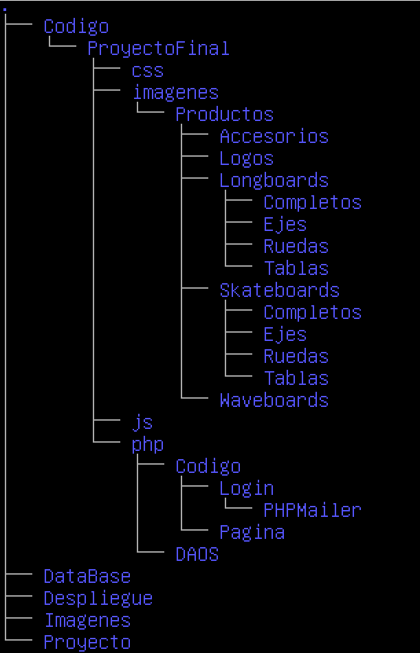

### Contenido directorios

> Codigo/ProyectoFinal: Contiene todo el proyecto.
> 
> `css` -> Contiene las hojas de estilo css de la página.
> 
> `imagenes` -> Contiene las imágenes necesarias para ciertas partes de la web, como por ejemplo el logo del menú.
> 
> `imagenes/Productos` -> Esta carpeta que a la vez contiene subdirectorios contiene imagenes de ejemplo para la venta de productos.
> `js` -> Contiene los script de JavaScript necesarios para la página.
> `php/Codigo` -> Esta carpeta contiene los archivos php de la web, dentro contiene dos carpetas uno para los archivos de login y registro y el otro directorio para el resto de la página. En la carpeta Login, se encuentra otra dentro que es PHPMailer, esta es necesaria por el uso de esta librería en la recuperación de contraseña.
> `DAOS` -> En esta carpeta se encuentra los archvios php que contienen la conexion a la BBDD y las consultas a mysql necesarias.

## Diseño de la interface


> El sitio web consta de tres partes fundamentales. Esta estructura es común en todas las páginas que forman el sitio web.
> 
> **Menu**: Contiene los enlaces para navegar por la web y el logo de la empresa.
> 
> **Contenido**: Esta ubicado justo debajo del menú. Alberga el contenido de la página, por ejemplo, en la página de inicio habrá, dos o tres carruseles, o en el Catálogo habra un contenedor con la cartas de los productos.
> 
> **Footer**: Este solo estará en algunas zonas de la página el cual contendra, un pequeño texto, el logo de la empresa, enlaces a nuestras redes sociales y el copyrigth.
> 


### Estructura gráfica de la interface

Esta es la estructura de la interface con footer.

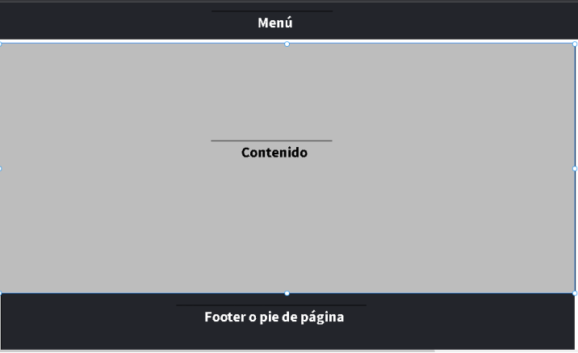

Esta es la estructura de la interface sin footer.

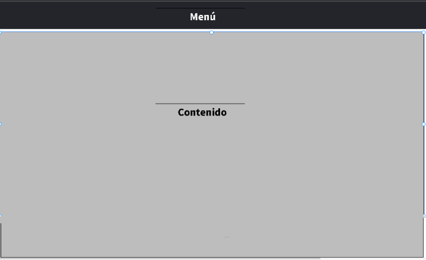

# IMPLEMENTACIÓN

## REQUISITO 1: Inicio de sesión y registro

Para poder cumplir con este requisito se usado un formulario en el cual se recogen los datos se validan con la base de datos y mediante sesiones de php se guardan los datos en la sesión. Para evitar que usuarios se metan donde no deban se han asignado dos roles, Usuarios y Admin.
## REQUISITO 2: Recuperación de credenciales.

En caso de que hayas pérdido la contraseña, no te preocupes porque en nuestra web te proporcionamos un método para recuperarla, para ello se ha utilizado PHPMailer.

### Funcionamiento

En primer lugar se comprueban ciertos datos que solo el dueño de la cuenta puede saber, se recogen mediante un formulario y se envian a otro archivo y gracias a la libreria PHPMailer podemos enviar un correo a tu email para que puedas actualizar tu password.

### Ejemplo de código
**Solo se muestra una pequeña parte del codigo.**
```
<?php
require '../../DAOS/conectorBD.php';
require '../../DAOS/DAOUsuario.php';
require '../../DAOS/Config.php';

$conexion=conectar(true);


$usuario = $_POST['usuario'];
$email = $_POST['email'];
$dni = $_POST['dni'];


use PHPMailer\PHPMailer\PHPMailer;
$validarUsuario = validarUsuario($conexion, $usuario);
$validarEmail = validarEmail($conexion, $email, $usuario);
$validarDni = validarDni($conexion, $dni, $usuario);

if(mysqli_num_rows($validarUsuario)==0){
    header ('Location: recuperarContraseña.php?error=usuarioNoEncontrado');
    
}else if(mysqli_num_rows($validarEmail)==0){
    header ('Location: recuperarContraseña.php?error=emailIncorrecto');
}else if(mysqli_num_rows($validarDni)==0){
    header ('Location: recuperarContraseña.php?error=dniIncorrecto');
}else{
    // SI EXISTEN SE ENVIA EL EMAIL
    $nomUsuario =$_POST['usuario'];
    $name = "SK8 OR DIE";
    $subject = "Recuperar contraseña SK8 OR DIE";
    $texto= "aquí";
    $ip=$_SERVER['SERVER_ADDR'];
    $url="http://".$ip."/SK8ORDIE/Codigo/ProyectoFinal/php/Codigo/Login/nuevaPassword.php?user=$nomUsuario";
    $body ="Pulsa "."<a href='$url'>$texto</a>"." para cambiar tu contraseña.";

    require_once "PHPMailer/PHPMailer.php";
    require_once "PHPMailer/SMTP.php";
    require_once "PHPMailer/Exception.php";
    $subject = utf8_decode($subject);
    $body = utf8_decode($body);
    $mail = new PHPMailer();

    // CONFIGURACION SMTP 
    $mail->isSMTP();
    $mail->Host = "smtp.gmail.com";
    $mail->SMTPAuth = true;
    $mail->Username = "sk8ordie7983@gmail.com";
    $mail->Password = 'gragrgjrzqdxghgt';
    $mail->Port = 465; //587
    $mail->SMTPSecure = "ssl"; //tls

    //CONFIGURACION EMAIL
    $mail->isHTML(true);
    $mail->setFrom($email, $name);
    $mail->addAddress($email);
    $mail->Subject = $subject;
    $mail->Body = $body;

    if ($mail->send()) {
        header('Location: login.php?accion=emailEnviado');
    } else {

    
    }
}

?>

```

## REQUISITO 3: Perfil para los datos de los usuarios.
Los usuarios tendrán un perfil con los datos que se han proporcionado en el registro, el perfil podrán modificarlos, además de poder darse de baja en la página. Para cumplir con este requisitos simplemente se han usado consultas de mysql, UPDATES sobre todo. Para el CRUD de los administradores es lo mismo, mediante consultas Insert, Update y Delete se permite añadir, modificar y eliminar usuarios o productos.

### Ejemplo de codigo:

**Un pequeño ejemplo de estas consultas serían las siguientes:**
```
function editarUsuario($conexion,$idUsuario, $usuario){
    $consulta = "UPDATE usuarios SET Usuario = '$usuario' WHERE (`idUsuarios` = '$idUsuario');";
    $resultado = mysqli_query($conexion,$consulta);
    return $resultado;
}
function registro($conexion, $nombre, $usuario, $password, $primerapellido, $segundoapellido, $dni, $email, $telefono, $fotoperfil){

    $consulta = "INSERT INTO `usuarios` (`Nombre`, `Usuario`, `Password`, `PrimerApellido`, `SegundoApellido`, `Dni`, `Email`, `Telefono`, `Rol`, `FotoPerfil`, `Direccion`,`ComunidadAutonoma`,`Provincia`, `Ciudad`, `CodigoPostal`) VALUES ('$nombre', '$usuario', '$password', '$primerapellido', '$segundoapellido', '$dni', '$email', '$telefono', 'Usuario', '$fotoperfil','','','','','')";
    $resultado = mysqli_query($conexion, $consulta);
    return $resultado;
}

function eliminarUsuario($conexion, $idUsuario){

    $consulta = "DELETE FROM usuarios WHERE idUsuarios = '$idUsuario'";
    $resultado = mysqli_query($conexion, $consulta);
    return $resultado;
}

```
## REQUISITO 4: Carrousel.

Para los carrouseles simplemente se ha usado bootstrap y con una consulta de mysql se muestran productos random.

### Ejemplo de codigo:

**Un ejemplo de uno de los carruseles es el siguiente**

```
<div class="d-none d-sm-none d-md-block col-md-6">
<h1 class="tituloHome text-center">BOARDS</h1>
    <div id="carouselExampleControls1" class="carousel slide" data-ride="carousel" style="width:100%; height: 440px;">
    <div class="carousel-inner">
        <?php
        $buscarProductosRandom =  buscarProductosRandom($conexion);
        $i = 0;
        $enlace="";
        while($productosRandom = mysqli_fetch_assoc($buscarProductosRandom)){
            $enlace="DetallesProductoSkateBoardsCompletos.php?id=".$productosRandom['idProductos'];
        ?>
        <div class="carousel-item <?php echo ($i == 0) ? 'active' : '';?>">

          <span style="display: flex; justify-content: center; background: #fff; border: none;">
            <a href="<?php echo $enlace; ?>"> " style="width:100%; height: 100%;" ></a>
            </span>
        </div>
        <?php
            $i++;
        }
        ?>
    </div>

    <button style="background: #fff; border: none;" class="carousel-control-prev rounded" type="button" data-target="#carouselExampleControls1" data-slide="prev">
        <span class="carousel-control-prev-icon" aria-hidden="true"></span>
        <span class="sr-only">Previous</span>
    </button>
    <button style="background: #fff; border: none;" class="carousel-control-next rounded" type="button" data-target="#carouselExampleControls1" data-slide="next">
        <span class="carousel-control-next-icon" aria-hidden="true"></span>
        <span class="sr-only">Next</span>
    </button>
    </div>
    
</div>
```
**Un ejemplo de la consulta para los productos random**

```
function buscarProductosRandom($conexion){
    $consulta = "SELECT DISTINCT * FROM productos 
    where idCategoriaFK='1' 
    or idCategoriaFK='2'  
    or idCategoriaFK='5'
    or idCategoriaFK='6'
    or idCategoriaFK='9'
    order by rand() Limit 6;";
    $resultado= mysqli_query($conexion,$consulta);
    return $resultado;
}
```
## REQUISITO 5: Catalogo.

Para mostrar las cards de los catalogos se ha usado ajax.

### Ejemplo de codigo:

**Ejemplo donde se usa ajax**

```
  mostrarProductos();
    function mostrarProductos(){
        
        $.ajax({
            url: 'MostrarProductosCatalogo.php',
            type: 'POST',
            async:false,
            success: function (response){
                
                $('#listaProductos').html(response);
            }
        })
    
    }
```

**Ejemplo codigo del php**

```
<?php 

require '../../DAOS/conectorBD.php';
require '../../DAOS/DAOProductos.php';
$conexion = conectar(true);
$salida='';
$categoria=1;
$listarProductos=listarProductosSegunCategoria($conexion, $categoria);
session_start();
while($productos=mysqli_fetch_array($listarProductos)){
    if($_SESSION['usuarioConectado']==true){
        $salida='
        <div class="card cartaCatalogo my-3">
        
            <div class="card-body">
                <h5 class="product-name">'.$productos['NombreProducto'].'</h5>
                <p style="margin-bottom:0px;">Precio: '. $productos['Precio'].'€</p>
                <p style="margin-bottom:0px;">Stock: '. $productos['Stock'].'</p>
                <p><b>'. $productos['NombreCategoria'].'</b></p>
                 <div class="row card-btn">
                     <div><a href="DetallesProductoSkateBoardsCompletos.php?id='.$productos['idProductos'].'" class="btn detalles  my-2 mx-2" >Detalles </a> </div>
                     <div><a href="#" data-stock="'.$productos['Stock'].'" data-precio="'.$productos['Precio'].'" data-id="'.$productos['idProductos'].'" id="btnAñadirProducto" name="btnAñadirProducto" class="btn btn-addCar  my-2 mx-2 btnAñadirProducto">Añadir <i class="fas fa-cart-plus"></i></a></div>
                 </div>   
                
            </div>
        </div>
        ';
    }else if($_SESSION['usuarioConectado']==false){
        $salida='
        <div class="card cartaCatalogo my-3">
        
            <div class="card-body">
                <h5 class="product-name">'.$productos['NombreProducto'].'</h5>
                <p style="margin-bottom:0px;">Precio: '. $productos['Precio'].'€</p>
                <p style="margin-bottom:0px;">Stock: '. $productos['Stock'].'</p>
                <p><b>'. $productos['NombreCategoria'].'</b></p>
                 <div class="row card-btn">
                     <div><a href="DetallesProductoSkateBoardsCompletos.php?id='.$productos['idProductos'].'" class="btn detalles  my-2 mx-2" >Detalles </a></div>
                     <div><a href="#" id="btnAñadirProductoSinSesion" name="btnAñadirProductoSinSesion" class="btn btn-addCar  my-2 mx-2">Añadir<i class="fas fa-cart-plus"></i></a></div>
                 </div>   
                
            </div>
        </div>
        ';
    }
    echo $salida;
}

?>
```
## REQUISITO 6: Diseño responsive.

Para el diseño responsive se ha usado bootstrap, gracias a sus clases .container para los contenedores y .row para las filas, ya que estas usan css grid. CSS tambien se usado en algún que otro caso eventual con las mediaquerys.

### Ejemplo de codigo:

**Ejemplo de código bootstrap**

```
 <div class="container-fluid mt-5">
      <div class="row">
        <?php include 'CarouselEjes.php'; ?>
        <?php include 'CarouselSkates.php'; ?>
        <?php include 'CarouselRuedas.php'; ?>
        <?php include 'CarouselMoviles.php'; ?>
      </div>
    </div>
```
**Ejemplo de código mediaquerys CSS**

```
@media (max-width:1060px){
    .encabezado .navigation .menu{
        position: fixed;
        display: block;
        background: #23252b;
        min-width: 350px;
        height: 100vh;
        top: 0;
        right: -100%;
        padding: 90px 50px;
        visibility: hidden;
        list-style: none;
        user-select: none;
        overflow-y: auto;
        transition: 0.5s;
        transition-property: right, visibility;
    }
  }
```
## REQUISITO 7: Control de errores.

Para el control de errores se ha usado JavaScript, basicamente se recoge elemento mediante el id, junto al mensaje de error y mediante una funcion se valida y con un evento se activa la validació

### Ejemplo de codigo:

**Pequeña parte del js de login**

```

let formularioLogin = document.getElementById("formularioLogin");
let usuario = document.getElementById("usuario");
let password = document.getElementById("password");


//Errores

let errorUsuario = document.getElementById("errorUsuario");
let errorPassword = document.getElementById("errorPassword");
let errorFormulario = document.getElementById("errorFormulario");


//Patrones

const patrones={

usuario: /\w{4,30}/,
password:  /^(?=.{6,45}$)(?=.*[a-z])(?=.*[A-Z])(?=.*[0-9])(?=.*[@,$,€,¿,?,¡,*,#,&,_,-]).*$/


}


function validarUsuario(){

    if(patrones.usuario.test(usuario.value)){
        usuario.className = "form-control is-valid";
        errorUsuario.classList.remove("mensaje-errorActivo");
        errorUsuario.classList.add("mensaje-error");
        return true;
    }else{
        usuario.className = "form-control is-invalid";
        errorUsuario.classList.remove("mensaje-error");
        errorUsuario.classList.add("mensaje-errorActivo");
        return false;
    }
}
```


# PRUEBAS

> Para la realización de las pruebas he montado una máquina virtual con linux + apache + mysql + php.
> 
> A lo largo del desarrollo he subido diferentes versiones y comprobado las diferentes funcionalidades.

> En cuanto a la página, he probado a registrarme, iniciar sesión, recuperar contraseña, editar los datos del perfil, darse de baja, añadir un producto al carrito, aumentar y reducir su cantidad, eliminar un producto del carrito, vaciar el carrito y realizar el pago.

> En cuanto a la administración se ha probado eliminar, modificar, añadir usuarios y productos. Además se ha controlado que a estos paneles no accedan individuos que no tengan el rol "Admin" o accedan mediante un enlace.

# DESPLIEGUE

Creación de un Script en BASH que permita el despliegue en automático de la aplicación en cualquier servidor linux, que contenga un Apache+PHP y una base de datos SQL.


# HERRAMIENTAS

Para el desarrollo de proyecto se ha usado Visual Studio Code que es, un editor de
código fuente desarrollado por Microsoft para Windows, Linux y macOS que incluye
soporte para la depuración, control integrado de Git, resaltado de sintaxis, finalización
inteligente de código, fragmentos y refactorización de código. Se ha usado este IDE
por las numerosas posibilidades de personalización que integra, las extensiones que
trae y por la comodidad para desarrollar código y creación de directorios como de
archivos.

También se ha usado MAMP que es una aplicación que nos permitirá montar nuestro
propio servidor local. De forma rápida y sencilla dispondremos de Apache, MySQL y
PHP.

Se ha usuado mysql WorkBench para tener la base de datos mas accesible.

Finalmente se ha usado un servidor debian con todos los servicios necesarios. Este,
es el servidor en el que se desplegara la página finalmente.
# LENGUAJES

HTML: HTML (Lenguaje de Marcas de Hipertexto, del inglés HyperText Markup
Language) es el componente más básico de la Web. Define el significado y la
estructura del contenido web.
JavaScript: JavaScript es el lenguaje de programación encargado de dotar de mayor
interactividad y dinamismo a las páginas web. Cuando JavaScript se ejecuta en el
navegador, no necesita de un compilador. El navegador lee directamente el código, sin
necesidad de terceros.
CSS: CSS son las siglas en inglés para «hojas de estilo en cascada» (cascading style
sheets). Básicamente, es un lenguaje que maneja el diseño y presentación de las
páginas web, es decir, cómo lucen cuando un visitante las visita. Funciona junto al
lenguaje HTML, que se encarga del contenido básico de las páginas.
JQuery: JQuery es una librería de JavaScript (JavaScript es un lenguaje de
programación muy usado en desarrollo web). Esta librería de código abierto, simplifica
la tarea de programar en JavaScript y permite agregar interactividad a un sitio web sin
tener conocimientos del lenguaje.
Ajax: AJAX, acrónimo de Asynchronous JavaScript And XML (JavaScript asíncrono y
XML), es una técnica de desarrollo web para crear aplicaciones web asíncronas. Estas
aplicaciones se ejecutan en el cliente, es decir, en el navegador de los usuarios
mientras se mantiene la comunicación asíncrona con el servidor en segundo plano. De
esta forma es posible interactuar con el servidor sin necesidad de recargar la página
web, mejorando la interactividad, velocidad y usabilidad en las aplicaciones.
Bootstrap: Bootstrap es un framework front-end utilizado para desarrollar aplicaciones
web y sitios mobile first, o sea, con un layout que se adapta a la pantalla del dispositivo
utilizado por el usuario.
Importante: Estos son los lenguajes que podría usar en el proyecto, no quiere decir que
los vaya usar todos al 100%, es decir, podría existir la posibilidad de que no los usara.
# PRODUCTO

Se muestran diferentes pantallas que constituyen el desarrollo final de la aplicación:

## Página de Inicio


## Página de Inicio 2

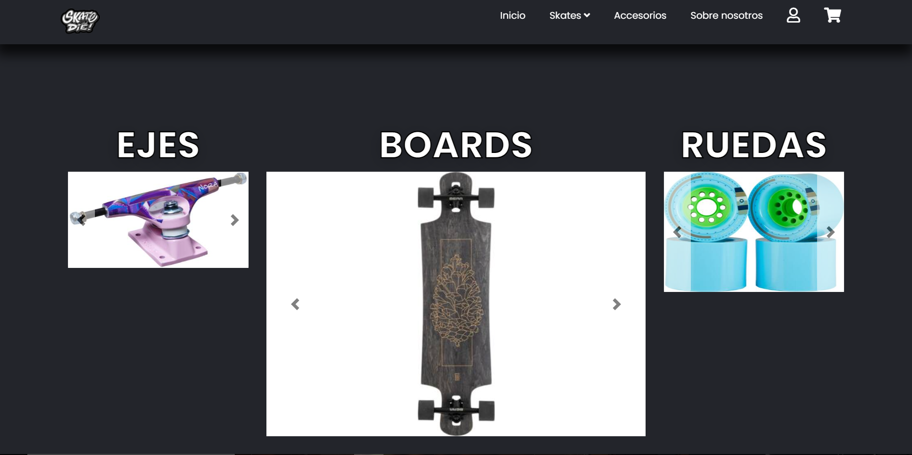

## Footer

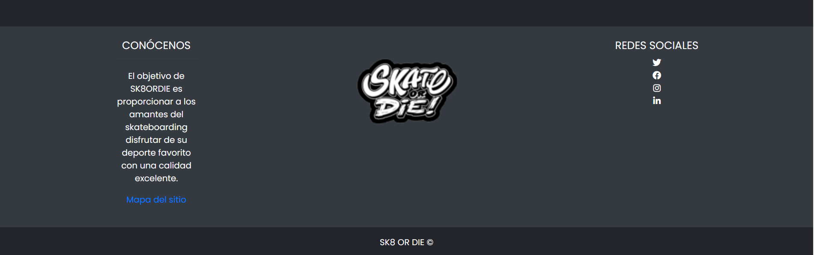

## Cálogo

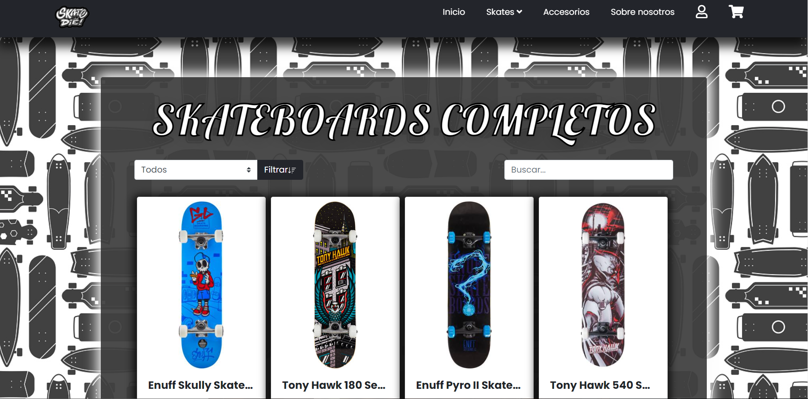

## Cálogo Mejor Perspectiva

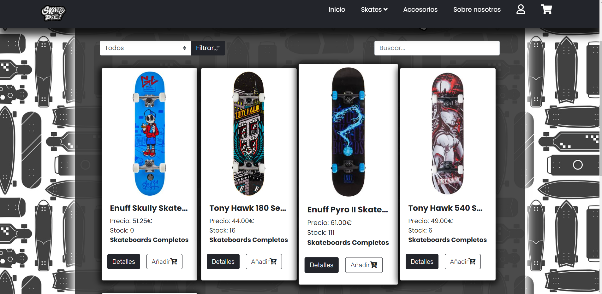

## Sobre Nosotros

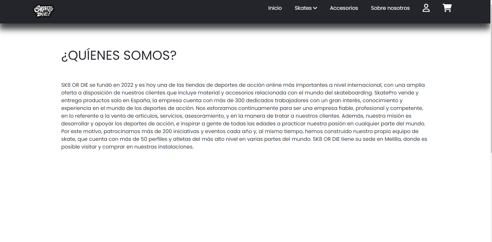

## Sobre Nosotros


## Registro

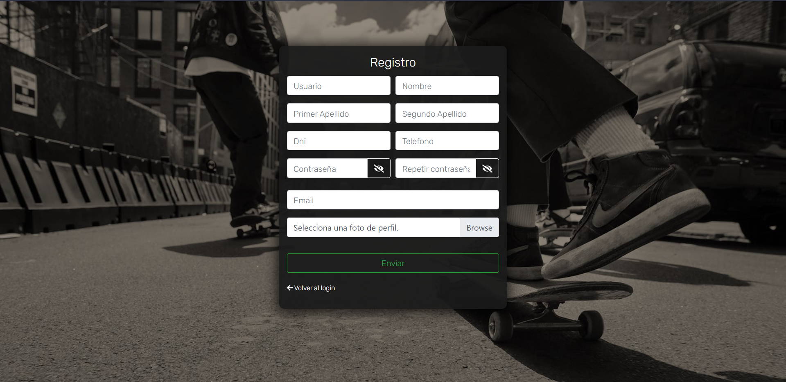

## Recuperar Contraseña


## Perfil

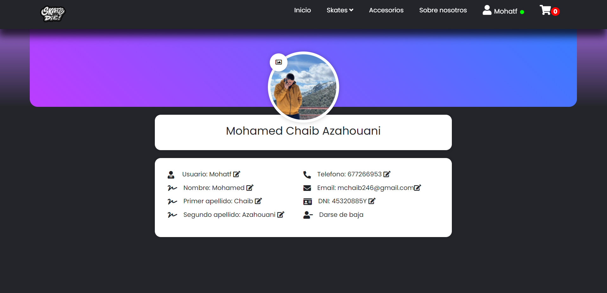

## Administración

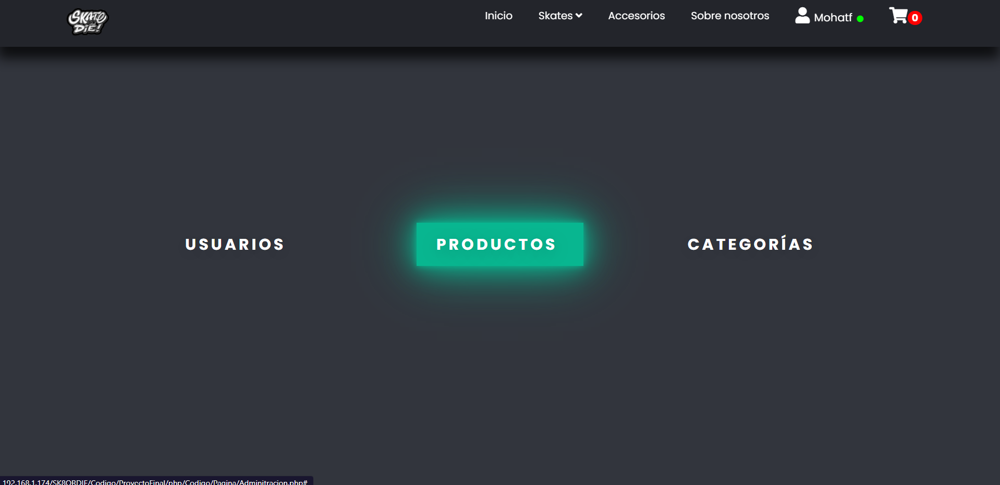

## Administración de Usuarios

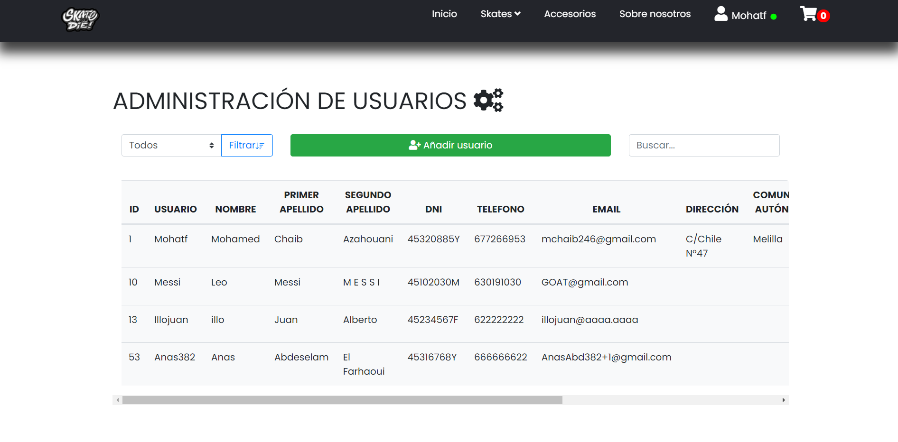

## Editar Usuarios

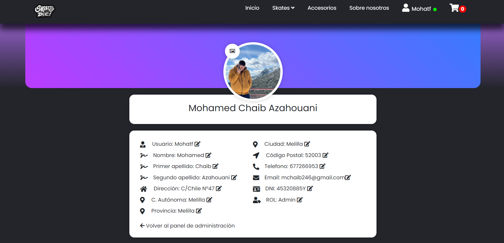

## Administración de Productos

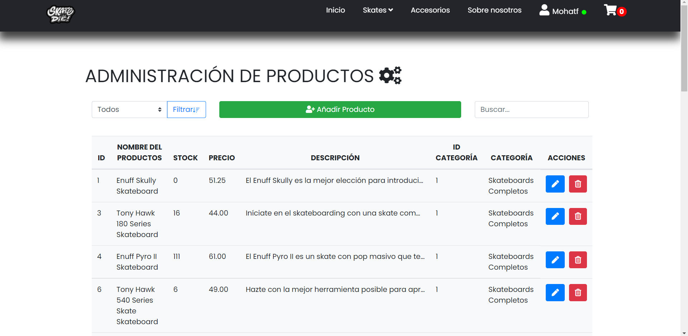

## Editar Productos

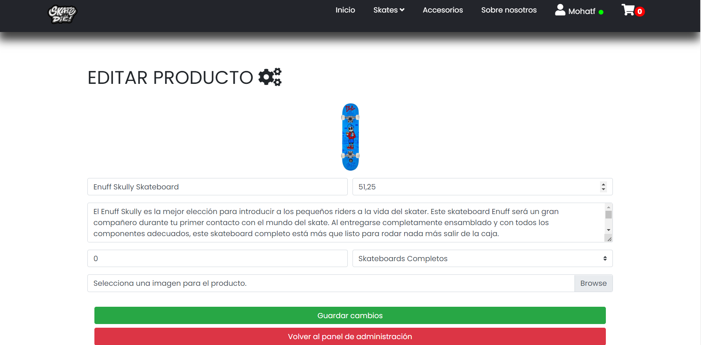

## Listado de Categorías

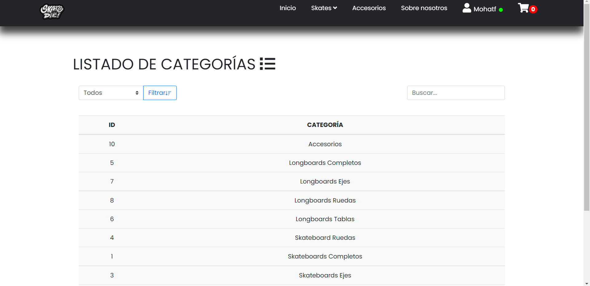

## Carrito sin nada

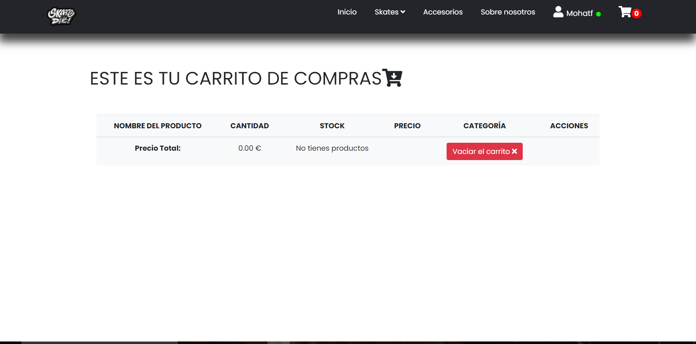

## Carrito con Productos

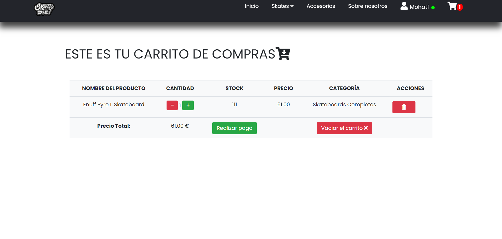

## Pago Finalizado

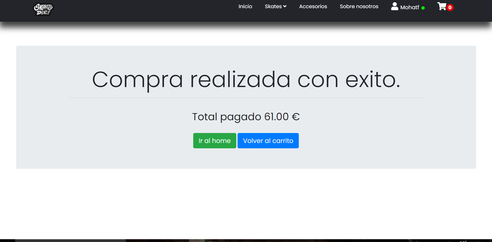

## Mapa del Sitio

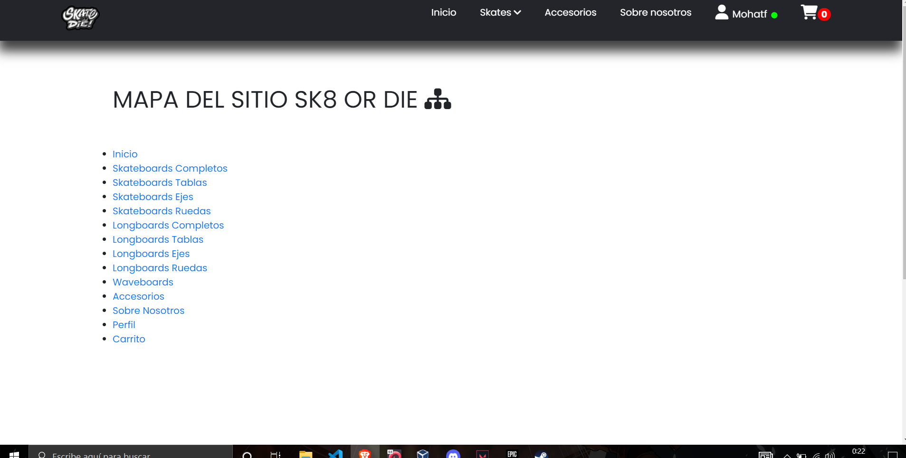

# BIBLIOGRAFÍA

Documentación PHP:
https://www.php.net/docs.php
Documentación Bootstrap:
https://getbootstrap.com/docs/4.6/getting-started/introduction/

Uso de iconos Font-awesome:
https://fontawesome.com/v5.15/icons?d=gallery&p=2

JQUERY:
https://jquery.com/

Documentación Mysql:
https://dev.mysql.com/doc/

PHPMailer Documentación:
https://github.com/PHPMailer/PHPMailer

W3SCHOOL:
https://www.w3schools.com/